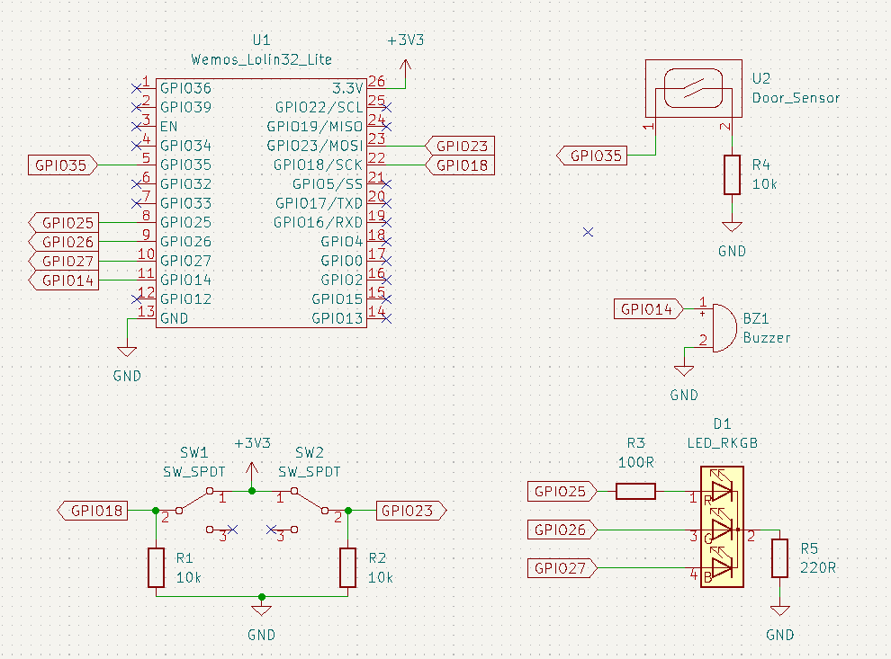

# Smart Door Sensor Project

## Table of Contents

* [Table of Contents](#table-of-contents)
* [Introduction](#introduction)
* [Brief](#brief)
* [Method of Operation](#method-of-operation)
  + [Setting up The Device](#setting-up-the-device)
  + [Using the Device](#using-the-device)
* [Circuitry](#circuitry)
  + [Full Schematic](#full-schematic)
  + [Veroboard Prototype](#veroboard-prototype)
  + [PCB](#pcb)
* [Further Work](#further-work)

## Introduction

This originally started as a university project, and I have continued to develop this idea in my spare time.

## Brief

This project is a smart door alarm for security in university accommodation and hotel rooms. When somebody enters the room, the buzzer will sound, or the device will email the user. This standalone device does not require a smart hub to operate.

## Method of Operation

  

### Setting up The Device

1. Plug the device into a phone charger and switch the charger on.

2. Open the Wi-Fi settings on your smartphone and wait for the “S.P.U.D Smart
   System” network to appear. Once it appears, connect to it.

3. Turn off mobile data on your phone.

4. Open your phone’s web browser and enter “192.168.1.1” into the address bar.
   
   

     
   

5. When the page loads, input the following information:
   • Wi-Fi SSID - The name of your Wi-Fi network
   • Wi-Fi Password - Often found on the back of your Wi-Fi router
   • Device Name - The name which you want to give the device e.g., “Front Door”
   • Email Address - The email address to send notifications to
   • Your Name - The name which you want to appear on the email notifications

6. Press “Submit” and check that the credentials displayed on the next page are
   correct.

7. Wait for the LED on the device to flash green and then turn off the device and
   turn it back on again.

8. Now your device is setup.

9. Attach the sensor to the back of the door. Peel the sticky back off the main
   body and stick it to the edge of the door. Stick the magnetic contact to the
   door frame, as close to the sensor as possible. (Image showing device
   attached to door)

10. Open the door ensuring that the device does not catch on the door.

### Using the Device

  

Switching either of the switches will alter the settings and cause the indicator LED to light (The colour of the LED shows which setting has changed).

| Indicator LED Colour | Meaning                 |
| -------------------- | ----------------------- |
| Blue                 | Buzzer ON               |
| Yellow               | Buzzer OFF              |
| Green                | Email Notifications ON  |
| Red                  | Email Notifications OFF |

Depending on the settings, the sensor will either buzz or send an email notification when the door is opened.

## Circuitry

### Full Schematic

  

### Veroboard Prototype

|  |  |
| ----------------------------------------- | ------------------------------------------ |

### PCB

  

|  |  |
| ---------------------------------- | --------------------------------- |

## Further Work

I will be working to re-design the board for this project. I want to use a latch to power the microcontroller when the door is opened and power it off once it has sent the email. This will reduce power consumption.